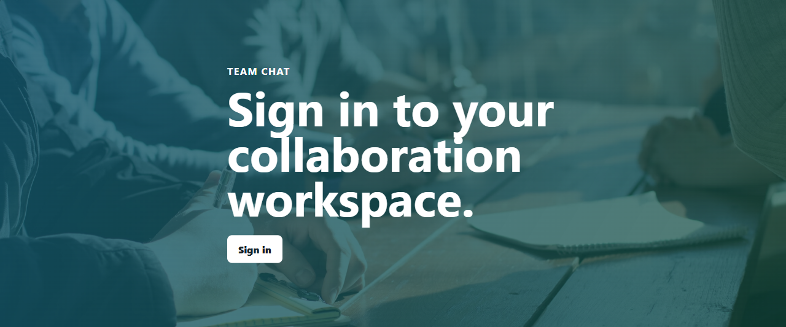
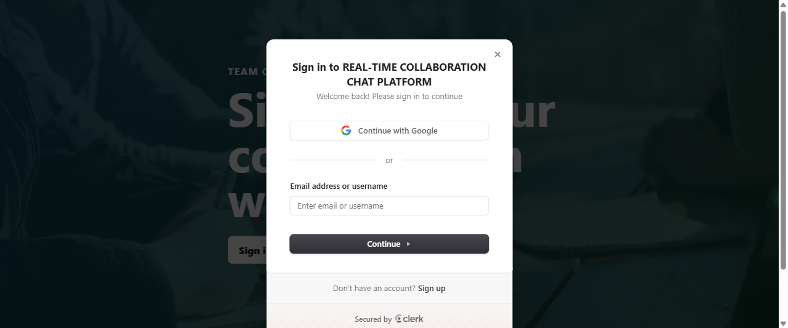
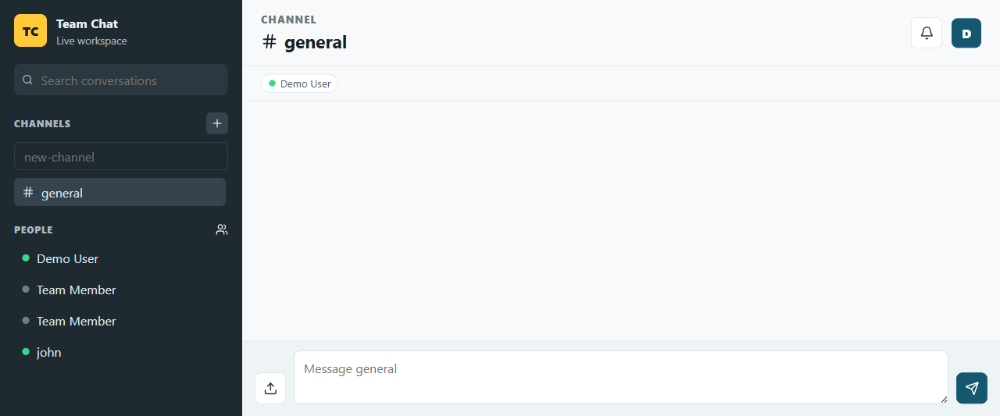
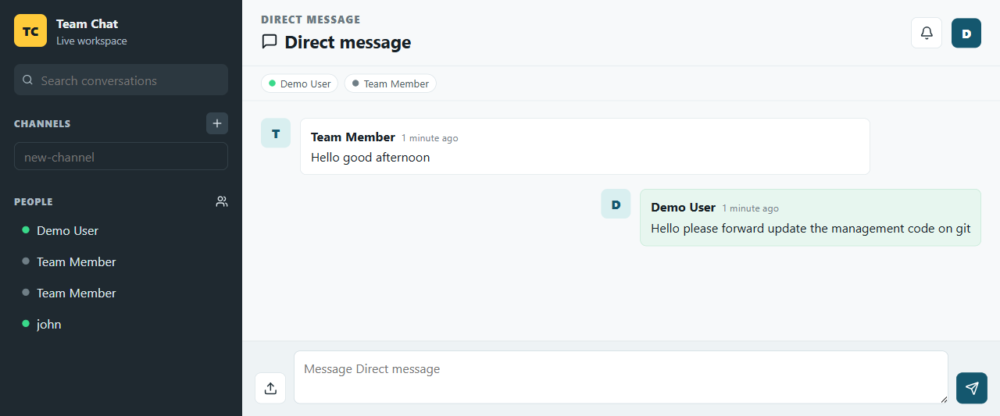

# Real-Time Collaboration Chat Platform

A full-stack Slack-style collaboration platform for teams. The application supports real-time direct messaging, channels, user presence, typing indicators, file uploads to AWS S3, MongoDB message persistence, Redis-backed realtime fan-out, Clerk authentication, and Docker-based local infrastructure.

This project is built as a senior-level portfolio/MVP system: the frontend and backend are separated, the realtime layer is scalable, the backend is typed and modular, and the local runtime mirrors a production service split with API, web, database, and cache containers.

## Product Screenshots

### Landing Sign-In



### Clerk Authentication Modal



### Channel Workspace



### Direct Message Conversation



## What This App Does

Team Chat gives a team one shared workspace for fast communication. Users sign in with Clerk, see online teammates, create or select channels, open direct messages, send messages instantly over websockets, and attach files. Messages are persisted in MongoDB so conversations survive refreshes and restarts.

The backend is designed so websocket traffic can scale across multiple API instances. A message created on one server instance is published through Redis and can be emitted by other instances to their connected clients. This is the same architectural direction used by larger realtime systems when a single websocket server is no longer enough.

## Core Features

- Clerk authentication with production-style JWT verification support
- React real-time chat workspace
- Channels for team-wide conversations
- 1:1 direct messages
- Group-ready channel model through member lists
- Socket.io realtime message delivery
- Typing indicators
- Online and offline presence
- MongoDB persistence for users, channels, and messages
- AWS S3 file upload support
- Local upload fallback when S3 is not configured
- Redis pub/sub for scalable realtime fan-out
- BullMQ notification queue foundation
- API and socket rate limiting for spam control
- Structured backend logging with Pino
- Docker Compose runtime for frontend, backend, MongoDB, and Redis
- TypeScript across frontend and backend
- Lint, typecheck, build, and audit verification

## Tech Stack

### Frontend

- React
- Vite
- TypeScript
- Socket.io Client
- Clerk React SDK
- Lucide React icons
- CSS modules/global app styling

### Backend

- Node.js
- Express
- TypeScript
- Socket.io
- Mongoose
- Redis with ioredis
- BullMQ
- AWS SDK for S3
- Clerk-compatible JWT verification with `jose`
- Pino logging
- Helmet, CORS, compression, and rate limiting

### Infrastructure

- Docker Compose
- MongoDB
- Redis
- Nginx frontend container
- Backend API container

## Architecture

```text
Browser
  |
  | HTTP + WebSocket
  v
React Frontend  ---> Clerk hosted auth
  |
  | REST API + Socket.io
  v
Express Backend
  |        |        |
  |        |        +--> AWS S3 file storage
  |        |
  |        +--> Redis pub/sub + BullMQ queues
  |
  +--> MongoDB users, channels, messages
```

## Runtime Flow

1. A user opens the React frontend at `http://localhost:3000`.
2. Clerk handles sign-in and provides an authenticated frontend session.
3. The frontend calls the Express API using the current auth token.
4. The backend verifies the user and upserts the user profile in MongoDB.
5. The frontend opens a Socket.io connection.
6. When a user joins a channel or direct message, the socket joins that room.
7. When a message is sent, the backend validates membership and persists it in MongoDB.
8. The backend emits the message to connected room members.
9. The message event is also published through Redis so other backend instances can fan it out.
10. File uploads go to S3 when configured.

## Project Structure

```text
REAL-TIME COLLABORATION CHAT PLATFORM/
|-- backend/
|   |-- src/
|   |   |-- config/
|   |   |   |-- env.ts              # Environment validation and runtime flags
|   |   |   `-- logger.ts           # Pino logger setup
|   |   |-- database/
|   |   |   |-- mongo.ts            # MongoDB connection
|   |   |   `-- redis.ts            # Redis clients for app, pub, and sub
|   |   |-- middleware/
|   |   |   |-- auth.ts             # Demo auth and Clerk JWT auth support
|   |   |   |-- errorHandler.ts     # Central Express error handler
|   |   |   `-- rateLimit.ts        # API and upload rate limits
|   |   |-- models/
|   |   |   |-- Channel.ts          # Channel, group, and DM model
|   |   |   |-- Message.ts          # Persistent message model
|   |   |   |-- NotificationSubscription.ts
|   |   |   `-- User.ts             # User and presence model
|   |   |-- queues/
|   |   |   `-- notifications.ts    # BullMQ notification queue foundation
|   |   |-- routes/
|   |   |   |-- channels.ts         # Channel, DM, and message REST APIs
|   |   |   |-- notifications.ts    # Notification subscription endpoint
|   |   |   |-- uploads.ts          # Multipart file upload endpoint
|   |   |   `-- users.ts            # Current user and user directory APIs
|   |   |-- services/
|   |   |   |-- channels.ts         # Channel/message business logic
|   |   |   |-- uploads.ts          # S3/local upload storage service
|   |   |   `-- users.ts            # User persistence and presence helpers
|   |   |-- sockets/
|   |   |   `-- chat.ts             # Socket.io chat, typing, presence, Redis pub/sub
|   |   |-- app.ts                 # Express app composition
|   |   |-- server.ts              # HTTP and Socket.io server entrypoint
|   |   `-- types.ts               # Shared backend request and domain types
|   |-- uploads/                   # Local development upload fallback
|   |-- Dockerfile
|   |-- package.json
|   `-- tsconfig.json
|
|-- frontend/
|   |-- public/
|   |   |-- favicon.svg
|   |   `-- sw.js                  # Browser service worker placeholder
|   |-- src/
|   |   |-- hooks/
|   |   |   `-- useChatSocket.ts    # Socket.io client lifecycle
|   |   |-- lib/
|   |   |   |-- api.ts              # Typed API client helpers
|   |   |   `-- types.ts            # Frontend domain types
|   |   |-- pages/
|   |   |   `-- App.tsx             # Main chat workspace UI
|   |   |-- styles/
|   |   |   `-- app.css             # Responsive app styling
|   |   |-- main.tsx                # Clerk/demo auth bridge
|   |   `-- vite-env.d.ts
|   |-- Dockerfile
|   |-- nginx.conf                 # Nginx SPA routing and larger auth cookie headers
|   |-- package.json
|   `-- vite.config.ts
|
|-- docs/
|   |-- assets/
|   |   `-- screenshots/           # README product screenshots
|   |-- API.md
|   |-- ARCHITECTURE.md
|   `-- ENVIRONMENT.md
|
|-- docker-compose.yml
|-- package.json
|-- package-lock.json
|-- .env.example
`-- README.md
```

## Environment Variables

Create `.env` from `.env.example` and fill in your real values.

```env
NODE_ENV=development
FRONTEND_URL=http://localhost:3000
VITE_API_URL=http://localhost:4000
VITE_WS_URL=http://localhost:4000
PORT=4000

MONGO_URI=mongodb://mongo:27017/teamchat
REDIS_URL=redis://redis:6379

AUTH_MODE=clerk
CLERK_JWT_ISSUER=https://your-clerk-instance.clerk.accounts.dev
CLERK_JWKS_URL=https://your-clerk-instance.clerk.accounts.dev/.well-known/jwks.json
CLERK_SECRET_KEY=sk_test_...
VITE_CLERK_PUBLISHABLE_KEY=pk_test_...

AWS_REGION=us-east-1
AWS_ACCESS_KEY_ID=...
AWS_SECRET_ACCESS_KEY=...
S3_BUCKET=ai-saas-uploads
S3_PUBLIC_BASE_URL=
```

For local development without Clerk, set:

```env
AUTH_MODE=demo
VITE_CLERK_PUBLISHABLE_KEY=
```

## Local Development

Install dependencies:

```bash
npm install
```

Run frontend and backend locally:

```bash
npm run dev
```

The direct local workflow expects MongoDB and Redis to already be running.

## Docker Runtime

Start the full stack:

```bash
npm run docker:up
```

Or directly:

```bash
docker compose up --build -d
```

Open:

```text
Frontend: http://localhost:3000
Backend:  http://localhost:4000/health
MongoDB:  localhost:27017
Redis:    localhost:6379
```

Stop the stack:

```bash
npm run docker:down
```

## API Overview

Protected routes live under `/api`.

```text
GET    /health
GET    /api/me
GET    /api/users
GET    /api/channels
POST   /api/channels
POST   /api/direct-messages
GET    /api/channels/:channelId/messages
POST   /api/channels/:channelId/messages
POST   /api/uploads
POST   /api/notifications/subscriptions
```

Socket events:

```text
channel:join
message:send
typing:start
typing:stop
message:read
presence:update
message:new
typing:update
```

## File Sharing

The upload route accepts multipart files and stores them through `backend/src/services/uploads.ts`.

If these values are configured, files are uploaded to S3:

```env
AWS_REGION=us-east-1
AWS_ACCESS_KEY_ID=...
AWS_SECRET_ACCESS_KEY=...
S3_BUCKET=ai-saas-uploads
```

If S3 is not configured, uploads are written to `backend/uploads` and served from `/uploads`.

## Security And Scalability Notes

- Clerk handles user identity.
- The backend validates authenticated requests before returning workspace data.
- Channel membership is checked before reading or sending messages.
- REST APIs are rate limited.
- Socket message sends are throttled.
- Helmet adds HTTP security headers.
- Redis pub/sub allows multiple backend instances to share realtime events.
- MongoDB stores durable message history.
- S3 keeps uploaded files outside the application container.
- Nginx is configured with larger header buffers to support auth cookies on localhost.

## Quality Checks

```bash
npm run typecheck
npm run lint
npm run build
npm audit --omit=dev
```

## Current Production Hardening Backlog

- Workspace/team invitations
- Channel membership management UI
- Message edit, delete, reactions, and threads
- Signed S3 upload URLs instead of backend-proxied uploads
- API and socket integration tests
- CI pipeline
- Deployment configuration for AWS, Render, Railway, or Fly.io
- Centralized metrics and tracing
- Secrets manager integration for production

## Documentation

- [Architecture](docs/ARCHITECTURE.md)
- [API](docs/API.md)
- [Environment](docs/ENVIRONMENT.md)
